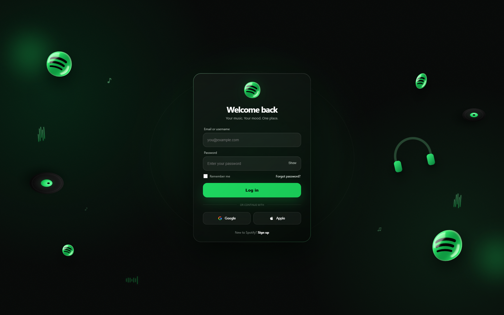

# 🎧 Spotify Login Page

> A modern, cinematic concept redesign of a music-streaming login experience — built from scratch with HTML, CSS and JavaScript.

## ✨ Live Preview

**Live Demo:** https://humbelly.github.io/spotify-reimagined-login/

## 🖥️ Preview



## 🚀 Features

- 🎨 Modern dark cinematic interface
- 🧊 Glassmorphism login card
- 🧲 Magnetic 3D card interaction
- 🌀 Perspective-based mouse parallax
- 🎵 Floating music-themed 3D elements
- 💿 Animated vinyl records
- 🎧 Floating headphone element
- 📊 Animated equalizer bars
- 〰️ Animated audio waveform
- 🟢 3D Spotify-inspired logo
- ✨ Ambient green lighting and glow
- 🔐 Password show/hide interaction
- 🔔 Animated toast notifications
- 📱 Responsive desktop, tablet and mobile layouts
- ♿ Reduced-motion support

## 🛠️ Built With

<p>
  
  
  
</p>

## 📂 Project Structure

```text
spotify-reimagined-login/
├── index.html
├── README.md
└── preview.png
```

## 🧑‍💻 Run Locally

```bash
git clone https://github.com/humbelly/spotify-reimagined-login.git
cd spotify-reimagined-login
```

Then open `index.html` in your browser.


## 🎯 Design Direction

A next-generation music login experience combining cinematic darkness, Spotify-inspired green lighting, glass surfaces, 3D depth, motion and interactive feedback.

## 🔐 Authentication

This project contains **front-end/demo authentication UI only**. It does not send credentials to Spotify or any external authentication service.

## ⚠️ Disclaimer

This is an independent design concept inspired by modern music-streaming interfaces.

**Spotify is a trademark of Spotify AB. This project is not affiliated with, endorsed by, or sponsored by Spotify.**

Do not use this demo to collect real Spotify usernames, passwords, or authentication credentials.

---

### Made with


**Made with HTML, CSS & JavaScript ✦**
